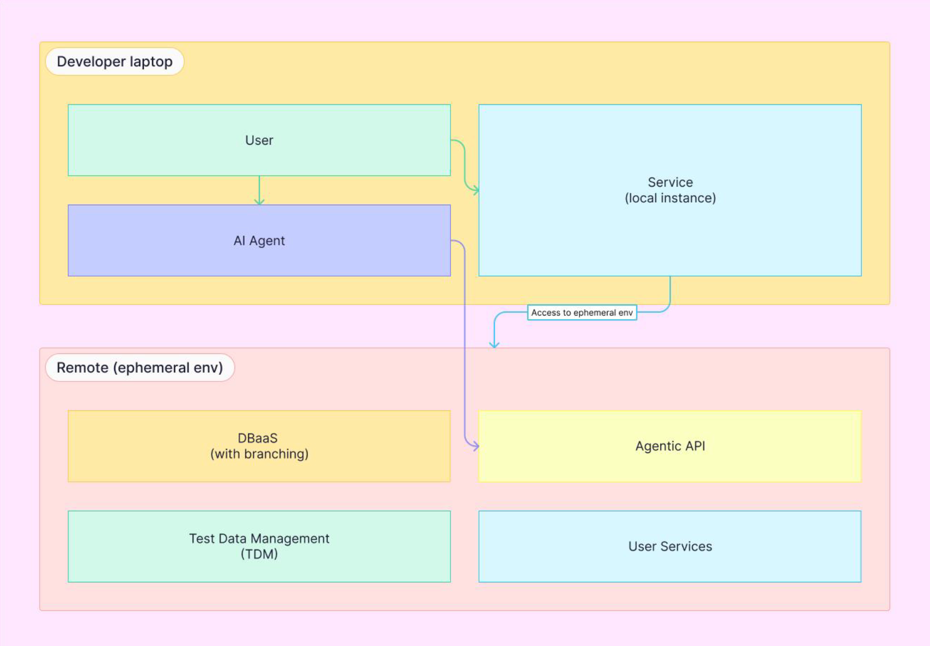

# Greenmask

Open-source Test Data Management (TDM) and data anonymization platform focused on secure production-like development
workflows.

Greenmask enables organizations to safely use realistic data in development, testing, staging, and AI-assisted
engineering environments without exposing sensitive information.

---

## Core Principles

- **Stateless architecture**
- **In-flight anonymization**
- **No persistent storage of raw production datasets**
- **Production-like development workflows**
- **Subset-oriented data pipelines**
- **Extensible transformation system**
- **Infrastructure and automation friendly**

---

## What Greenmask Provides

### Data Anonymization

Transform sensitive production data during logical dump workflows using configurable masking and transformation
pipelines.

### Test Data Management

Create secure production-like datasets for development, testing, staging, CI pipelines, and ephemeral environments.

### Subsetting

Extract only the required portion of production data while preserving relational consistency.

### Synthetic Data Generation

Generate realistic synthetic values and replacement datasets for non-production environments.

### Secure Development Workflows

Reduce the operational and security risks associated with long-lived raw production copies in lower-trust environments.

---

## Architecture

Greenmask is designed around a stateless, stream-oriented architecture:

Database → Logical Dump Stream → Transformation Pipeline → Storage / Restore

During anonymization workflows:

- data is processed in-flight;
- transformations are executed directly within the dump stream;
- sensitive raw datasets do not need to be persistently stored unmasked.

This model is designed to support secure development and testing workflows in regulated and compliance-driven
environments.

---

## Supported Databases

### Stable

- PostgreSQL

### Experimental

- MySQL

---

## Repositories

| Repository                                            | Description                                      |
|-------------------------------------------------------|--------------------------------------------------|
| [greenmask](https://github.com/GreenmaskIO/greenmask) | Core Greenmask engine and CLI                    |
| [examples](https://github.com/GreenmaskIO/examples)   | Examples, integrations, and deployment scenarios |

---

## Documentation

- Website: https://www.greenmask.io
- Documentation: https://docs.greenmask.io
- Security Policy: https://github.com/GreenmaskIO/greenmask/blob/main/SECURITY.md

---

## Community & Support

- GitHub Discussions
- GitHub Issues
- security@greenmask.io

For enterprise support and partnership inquiries, please contact us through the website.

---

## Future Platform Vision

Greenmask is evolving toward a platform designed for secure, production-like, ephemeral development environments.

Our long-term direction combines:

- Test Data Management (TDM)
- In-flight anonymization
- Ephemeral environments
- API-first infrastructure workflows
- AI-assisted development workflows
- DBaaS and infrastructure integrations

This architecture is intended to help developers and AI-assisted workflows rapidly provision isolated feature-specific
environments and safely iterate on realistic datasets.

Conceptual architecture:

This roadmap is being developed in collaboration with [Solanica](https://solanica.io/)
and [OpenEverest](https://openeverest.io/) as part of a broader effort to build open-source, enterprise-grade
infrastructure for modern software delivery workflows.

Read more in the announcement blog post:

Read more in
the [announcement blog post](https://www.greenmask.io/blog/greenmask-openeverest-automating-safe-production-data).

---

## License

Greenmask is open-source software released under the Apache 2.0 License.